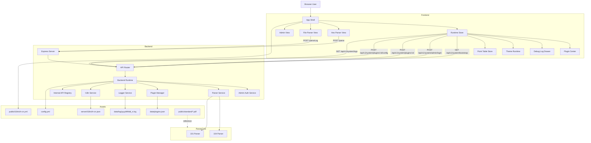

# Vue104Parser

IEC 60870-5-104 / DL/T634.5101-2002 parser workstation with a refactored runtime core, frontend/backend i18n, plugin scaffolding, theme system, admin-gated plugin management, and structured logging.

中文说明: [README.zh-CN.md](README.zh-CN.md)

## Highlights

- Parser-first backend core with internal APIs for future plugins.
- Frontend and backend i18n with English fallback.
- Runtime plugin registry for both frontend and backend capabilities.
- Theme system prepared for plugin-contributed theme presets.
- Read-only public plugin center plus admin-editable plugin center at `/admin`.
- File-based logger with `error/warn/info/debug` levels and debug log viewer API.

## Architecture



## Directory Layout

```text
VUE104Parser/
├─ config.yml
├─ public/
│  ├─ i18n/zh-cn.yml
│  ├─ iconLib/
│  └─ standard/
├─ server/
│  ├─ core/
│  ├─ i18n/
│  ├─ plugins/
│  ├─ routes/
│  ├─ config.ts
│  ├─ parseService.ts
│  ├─ protocolDetector.ts
│  ├─ runtime.ts
│  └─ server.ts
├─ src/
│  ├─ components/
│  ├─ composables/
│  ├─ i18n/
│  ├─ services/
│  ├─ stores/
│  ├─ theme/
│  ├─ views/
│  ├─ App.vue
│  └─ main.ts
├─ src_parsers/
│  ├─ 101ParserClass.ts
│  └─ 104ParserClass.ts
└─ docs/
   ├─ API.md
   ├─ API.zh-CN.md
   ├─ PLUGIN_SYSTEM.md
   └─ PLUGIN_SYSTEM.zh-CN.md
```

## Runtime Configuration

`config.yml`

```yaml
server:
  port: 33104

admin:
  username: "admin"
  password: "admin"

locale:
  default: "zh-cn"
  fallback: "en"
  frontend: "zh-cn"
  backend: "zh-cn"

logger:
  level: 3
  dir: "data/log"
  exposeDebugApi: true
  clientMirror: true

plugins:
  enabled:
    - "core.parser"
    - "core.log-viewer"
    - "core.db-tools"
    - "core.theme-ocean"
    - "core.theme-graphite"
  stateFile: "data/plugins.json"

theme:
  defaultMode: "system"
  defaultTheme: "theme-ocean"
```

Change the default admin password before exposing the service beyond trusted local use.

## Development

```bash
yarn
yarn dev
yarn build
```

Backend runs with `tsx watch server/server.ts`, frontend runs with Vite.

## Logging

- `error = 1`
- `warn = 2`
- `info = 3`
- `debug = 4`

Log files are stored in `data/log/yyyyMMdd_n.log`. Each restart creates a new incremented file for the same day.

Log line format:

```text
[backend][info]2026-06-23 12:00:00: parsed protocol payload {"route":"/parse","count":3}
```

Frontend can view current logs through the debug log drawer and the `/api/v1/system/logs` endpoint.

## Documentation

- [API documentation](docs/API.md)
- [API 中文文档](docs/API.zh-CN.md)
- [Plugin system documentation](docs/PLUGIN_SYSTEM.md)
- [插件系统文档](docs/PLUGIN_SYSTEM.zh-CN.md)

## Current Migration Notes

- Backend runtime, plugin registry, logger, admin auth, and i18n infrastructure are migrated.
- Frontend shell, theme runtime, plugin drawer, debug log drawer, and admin view are migrated.
- Existing parser pages still contain legacy rendering code and should be progressively migrated to the new i18n/runtime style in later iterations.
