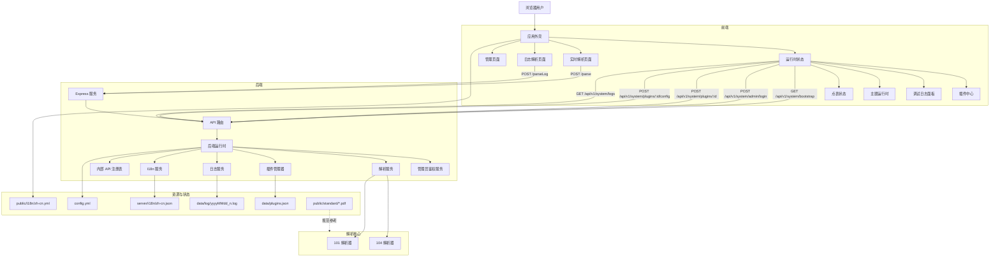

# Vue104Parser

基于 IEC 60870-5-104 / DL/T634.5101-2002 的规约解析工作台，包含重构后的运行时核心、前后端 i18n、插件脚手架、主题系统、管理员鉴权插件管理和结构化日志能力。

English version: [README.md](README.md)

## 特性概览

- 以后端解析器为核心，并预留内部 API 供后续插件扩展。
- 前后端均支持 i18n，并提供英文兜底。
- 统一的运行时插件注册表，支持前端与后端能力描述。
- 主题系统已为插件注入主题预设做好准备。
- 公共页面上的插件中心为只读，访问 `/admin` 登录后可管理插件。
- 基于文件的日志系统，支持 `error/warn/info/debug` 四级日志与调试日志查看能力。

## 系统架构



## 目录结构

```text
VUE104Parser/
├─ config.yml
├─ public/
│  ├─ i18n/zh-cn.yml
│  ├─ iconLib/
│  └─ standard/
├─ server/
│  ├─ core/
│  ├─ i18n/
│  ├─ plugins/
│  ├─ routes/
│  ├─ config.ts
│  ├─ parseService.ts
│  ├─ protocolDetector.ts
│  ├─ runtime.ts
│  └─ server.ts
├─ src/
│  ├─ components/
│  ├─ composables/
│  ├─ i18n/
│  ├─ services/
│  ├─ stores/
│  ├─ theme/
│  ├─ views/
│  ├─ App.vue
│  └─ main.ts
├─ src_parsers/
│  ├─ 101ParserClass.ts
│  └─ 104ParserClass.ts
└─ docs/
   ├─ API.md
   ├─ API.zh-CN.md
   ├─ PLUGIN_SYSTEM.md
   └─ PLUGIN_SYSTEM.zh-CN.md
```

## 运行时配置

`config.yml`

```yaml
server:
  port: 33104

admin:
  username: "admin"
  password: "admin"

locale:
  default: "zh-cn"
  fallback: "en"
  frontend: "zh-cn"
  backend: "zh-cn"

logger:
  level: 3
  dir: "data/log"
  exposeDebugApi: true
  clientMirror: true

plugins:
  enabled:
    - "core.parser"
    - "core.log-viewer"
    - "core.db-tools"
    - "core.theme-ocean"
    - "core.theme-graphite"
  stateFile: "data/plugins.json"

theme:
  defaultMode: "system"
  defaultTheme: "theme-ocean"
```

如果项目要暴露到可信本地环境之外，请先修改默认管理员密码。

## 开发

```bash
yarn
yarn dev
yarn build
```

后端默认使用 `tsx watch server/server.ts`，前端使用 Vite。

## 日志

- `error = 1`
- `warn = 2`
- `info = 3`
- `debug = 4`

日志文件保存在 `data/log/yyyyMMdd_n.log`，同一天内每次重启都会生成新的递增文件。

日志格式示例：

```text
[backend][info]2026-06-23 12:00:00: parsed protocol payload {"route":"/parse","count":3}
```

前端可通过调试日志面板查看当前日志，也可通过 `/api/v1/system/logs` 拉取。

## 文档

- [API documentation](docs/API.md)
- [API 中文文档](docs/API.zh-CN.md)
- [Plugin system documentation](docs/PLUGIN_SYSTEM.md)
- [插件系统文档](docs/PLUGIN_SYSTEM.zh-CN.md)

## 当前迁移状态

- 后端运行时、插件注册表、日志系统、管理员鉴权和 i18n 基础设施已迁移完成。
- 前端外壳、主题运行时、插件中心、调试日志面板和管理页已迁移完成。
- 现有解析页面仍保留部分旧渲染逻辑，后续可继续迁移到新的 i18n / runtime / plugin 风格。
